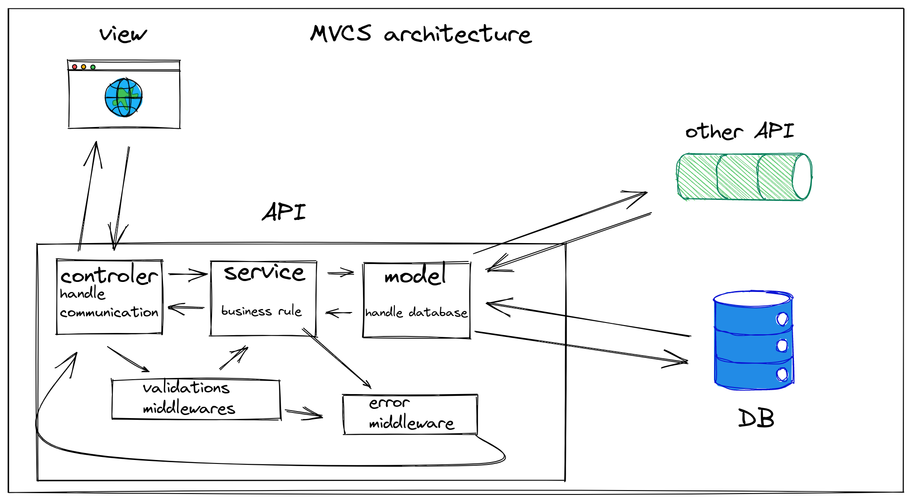

### __Planning:__ 

thinking about the deadline of 7 days and the scope of tasks, I organized the tasks as follows:
  
 

> 1 day for planning, describe api routes, design basic frontend layout.

> 3 days to develop the API sorting the requirements by priority.

    API priorities:
      1. implement at least one route using TDD (/register)
      2. implement login and register routes
      3. implement the rest of the routes if time remains

> 3 days to develop the frontend also separating requirements by priorities.

    priorities:
      1. implement the pages referring to the developed API routes
      2. if you have time, develop other features without API interaction

---

### __API OPEN BANKING 4CADIA__

 

### build with:
> javascript

> nodeJS

> express

> mongoDB

 

### architecture:
  - MVCS

  

:heavy_exclamation_mark: you can see the API routes documentation [here](https://app.swaggerhub.com/apis-docs/thalysmcarrara/OpenBanking/1.0.0) with more details:heavy_exclamation_mark:

 

### external libraries used:
  - joi: Used for creating schemas to validate the request body

  - bcrypt: Used to encrypt user password before saving to database
  
  - jsonwebtoken: Used to generate and validate tokens

 

- [link to deployed API](https://apidevtest4cadia.herokuapp.com/)

---

### __FRONTEND OPEN BANKING 4CADIA__

 

### build with:
> Javascript

> HTML

> Css

> React

 

### Design:
  [here](https://drive.google.com/drive/folders/1FGydKaO-iF2fRxpkgCwFkAvsndZc8nJS?usp=sharing) are the sketches created to use as a reference when developing the frontend.

 

- [repository](https://github.com/thalysmcarrara/frontend-devtest4acadia)

- [link to deployed application](https://openbankdevtest.herokuapp.com/)